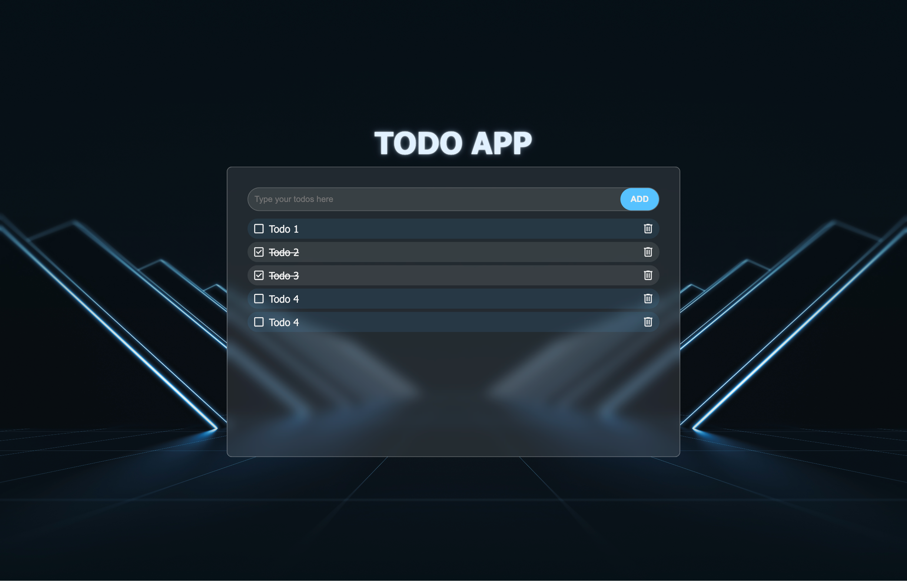
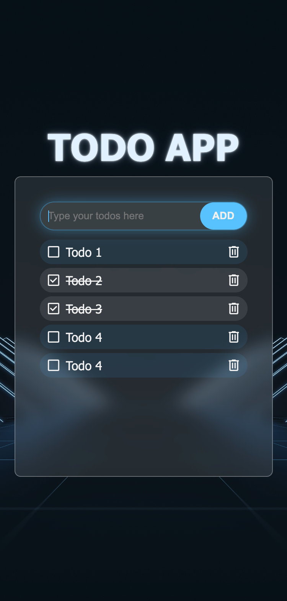

# Todo List App With Vanilla JS

## Overview

This is a classic todo list app built with plain (vanilla) JavaScript.  
Features include adding, removing, marking tasks as completed or active, persistent storage using Local Storage, basic animations, and a responsive layout.

[Live Demo](https://emretantu.github.io/todo-list-js)

## Table of Contents
- [Project source](#project-source)
- [The challenge](#the-challenge)
- [Screenshot](#screenshot)
- [Links](#links)
- [Built with (tech-stack)](#built-with-tech-stack)
- [What you need to know](#what-you-need-to-know)
- [Author](#author)

## Project source

The design was created from scratch — no UI template was used. I defined the entire UI and interaction behavior for this project.

## The challenge

Users should be able to:

- Add, delete, and toggle todo items between completed and active.
- Play a short delete animation using JavaScript when an item is removed.
- Persist the todo list in Local Storage so items persist after page reloads.
- (Optional) Use a "glassmorphism" (frosted glass) style to practice modern UI trends — this is optional and left to the implementer.
- Handle edge cases:
  - Prevent layout issues when users enter very long text.
  - Allow the app to remain centered while the list area becomes scrollable when there are many items.
  - Prevent adding empty entries.
  - Automatically trim leading/trailing whitespace from input.
- Pay attention to UX: at minimum allow adding items using the Enter key.
- Provide a clean, responsive layout across different screen sizes.
- Add hover and focus states to interactive controls for accessibility and visual polish.

Advanced challenges (optional):

> Note: I implemented many of these in a React version of this project, so they’re not required in this vanilla JS version.

- Make todo items reorderable through drag and drop.
- When a todo is marked as completed, animate it to automatically move to the bottom of the list.
- Add filters: All / Active / Completed.
- Provide a button to delete all completed items.
- Allow inline editing of an existing todo item.
- Add a progress bar reflecting completion percentage.
- Display an “add” button between items on hover, allowing users to insert new todos at that position.

## Screenshot

 

## Links

- [Live Demo](https://emretantu.github.io/todo-list-js)

## Built with (tech stack)

- HTML
- CSS
- Vanilla JavaScript

## What You Need to Know

- The tech stack listed above (HTML, CSS, Vanilla JavaScript).
- Familiarity with Local Storage for persistence.
- Basic knowledge of DOM manipulation and event handling.

## Author

**Emre Tantu**
- Website - [emretantu.dev](https://www.emretantu.dev)
- Contact - [hello@emretantu.dev](mailto:hello@emretantu.dev)
- LinkedIn - [in/emretantu](https://www.linkedin.com/in/emretantu/)
- Twitter - [@emretantu](https://www.twitter.com/emretantu)

---
---

# 🇹🇷 Todo List Uygulaması — Vanilla JS ile

## Genel Bakış

Bu, saf (vanilla) JavaScript kullanılarak yapılmış klasik bir todo list uygulamasıdır.  
Özellikler: görev ekleme, silme, yapılmış/yapılmamış olarak işaretleme, Local Storage ile kalıcı saklama, temel animasyonlar ve responsive (duyarlı) tasarım.

[Canlı Demo](https://emretantu.github.io/todo-list-js)

## İçindekiler
- [Proje kaynağı](#proje-kaynagi)
- [İstekler (Gereksinimler)](#istekler-gereksinimler)
- [Ekran Görüntüsü](#ekran-goruntusu)
- [Linkler](#linkler)
- [Kullanılan Teknolojiler](#kullanilan-teknolojiler)
- [Bilmeniz Gerekenler](#bilmeniz-gerekenler)
- [Geliştirici](#gelistirici)

## Proje kaynağı

Tasarım sıfırdan oluşturuldu — herhangi bir UI şablonu kullanılmadı. Bu projenin bütün kullanıcı arayüzü ve etkileşim davranışlarını ben tanımladım.

## İstekler (Gereksinimler)

Kullanıcılar şunları yapabilmelidir:

- Todo öğeleri ekleyebilmeli, silebilmeli ve tamamlandı / tamamlanmadı olarak işaretleyebilmeli.
- Bir öğe silindiğinde JavaScript ile küçük bir silme animasyonu tetiklenmeli.
- Todo listesi Local Storage'da saklanmalı, böylece sayfa yenilendiğinde öğeler korunmalı.
- (Opsiyonel) Güncel UI trendlerini pratiğe dökmek adına "liquid glass" / frosted glass tarzı bir görünüm tercih edilebilir — bu tamamen isteğe bağlıdır.
- Uç durumlar ele alınmalı:
  - Çok uzun metin girildiğinde layout'un bozulması engellenmeli.
  - Çok sayıda öğe olduğunda uygulama ekranın ortasında kalacak şekilde liste alanı scrollable olmalı.
  - Boş metin eklenmesine izin verilmemeli.
  - Girdi verisinin başındaki/sonundaki gereksiz boşluklar otomatik olarak kırpılmalı (trim).
- UX'e özen gösterilmeli: en azından ENTER tuşu ile ekleme mümkün olmalı.
- Cihaz ekran boyutuna göre optimal, responsive bir düzen sunulmalı.
- Etkileşimli kontroller için hover ve focus durumları sağlanmalı (erişilebilirlik ve görsel incelik için).

İleri seviye (opsiyonel) geliştirmeler:

> Not: Bu projenin React versiyonunda bunların çoğunu uyguladım; vanilla JS versiyonunda bunlar isteğe bağlıdır.

- Todo öğelerini drag & drop ile yeniden sıralanabilir yapmak.
- Bir todo tamamlandığında animasyonla otomatik olarak listenin en altına kaydırmak.
- Filtreler eklemek: All / Active / Completed.
- Tüm tamamlanmış öğeleri silen bir buton eklemek.
- Var olan bir todo öğesinin inline olarak düzenlenebilmesi.
- Tamamlama yüzdesini gösteren bir ilerleme çubuğu eklemek.
- İki todo öğesi arasına hover edildiğinde "ekle" butonu gösterip, bu butonla yeni öğe eklenmesi.

## Ekran Görüntüsü

 

## Linkler

- [Canlı Demo](https://emretantu.github.io/todo-list-js)

## Kullanılan Teknolojiler

- HTML
- CSS
- Vanilla JavaScript

## Bilmeniz Gerekenler

- Yukarıda listelenen teknoloji yığını (HTML, CSS, Vanilla JavaScript).
- Kalıcılık için Local Storage bilgisi.
- DOM manipülasyonu ve event handling hakkında temel bilgi.

## Geliştirici

**Emre Tantu**
- Website - [emretantu.dev](https://www.emretantu.dev)
- İletişim - [hello@emretantu.dev](mailto:hello@emretantu.dev)
- LinkedIn - [in/emretantu](https://www.linkedin.com/in/emretantu/)
- Twitter - [@emretantu](https://www.twitter.com/emretantu)
